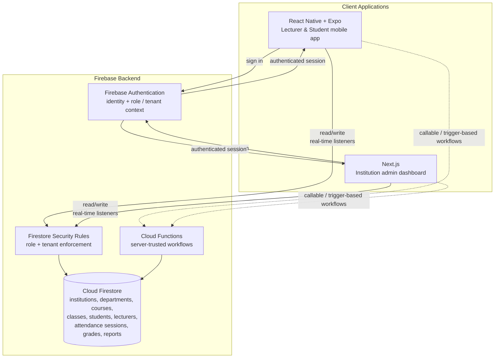
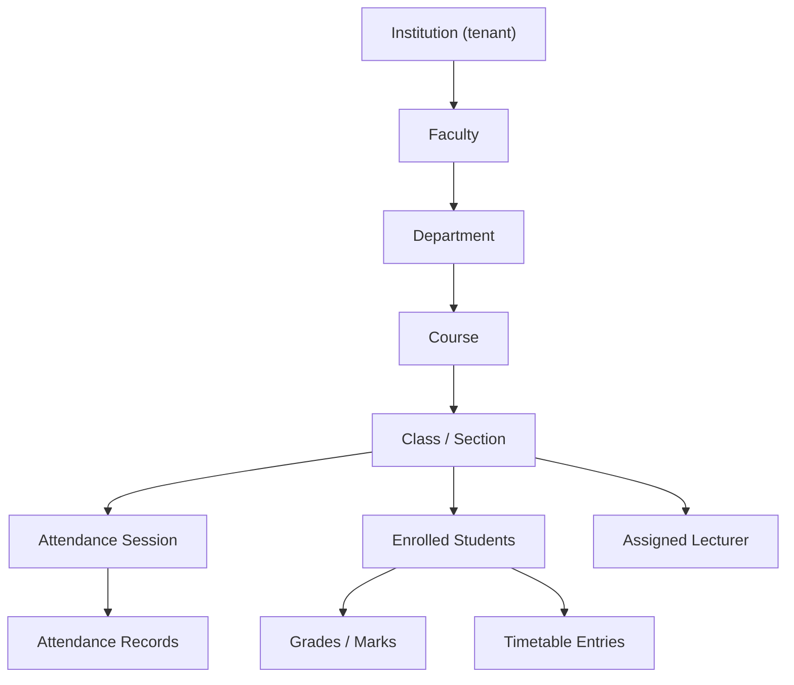
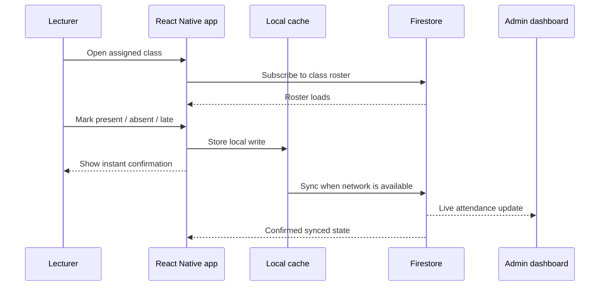

# Aqoon360

> A university and college management platform for attendance, student records, timetables, academic reporting, and institution administration.

**Built with React Native · Expo · Next.js · TypeScript · Firebase Auth · Firestore · Security Rules**

---

> **Note on source code**
>
> Aqoon360 is an active commercial product, and its production source code is private. This repository is a public engineering case study. It documents the product, system architecture, data and access model, and engineering decisions behind the platform without exposing application source code, Firebase configuration, API keys, security rules, customer data, or internal business logic.
>
> All diagrams and descriptions are intentionally generalized.

---

## Table of Contents

1. [Overview](#overview)
2. [Problem](#problem)
3. [Solution](#solution)
4. [Tech Stack](#tech-stack)
5. [Core Features](#core-features)
6. [Architecture](#architecture)
7. [Data & Access Model](#data--access-model)
8. [Attendance Workflow](#attendance-workflow)
9. [Web Admin Dashboard](#web-admin-dashboard)
10. [Security & Permissions](#security--permissions)
11. [Offline & Reliability](#offline--reliability)
12. [Testing](#testing)
13. [Engineering Challenges Solved](#engineering-challenges-solved)
14. [My Role](#my-role)
15. [Status](#status)
16. [Screenshots](#screenshots)

---

## Overview

Aqoon360 is a university and college management platform that digitizes academic operations across two coordinated product surfaces:

- **Mobile app** — a React Native + Expo app for lecturers and students.
- **Web dashboard** — a Next.js admin dashboard for institution administrators.

The platform helps institutions manage attendance, student records, timetables, staff, exams, grades, and reports in one structured system.

Aqoon360 is designed as a **multi-tenant** and **role-aware** platform. Each institution's data is isolated, and each role — admin, lecturer, student, and staff — receives a tailored experience backed by enforced access rules.

---

## Problem

Many universities and colleges still manage core academic operations with paper sheets, spreadsheets, and disconnected tools.

Common problems include:

- **Manual attendance sheets** are slow to collect, easy to lose, and difficult to analyze in real time.
- **Scattered spreadsheets** for students, timetables, and grades become outdated quickly.
- **Weak access control** makes it hard to protect student and academic data.
- **Disconnected admin workflows** force staff to re-enter the same data in multiple places.
- **No real-time visibility** means leadership cannot easily understand attendance or academic activity.
- **No mobile-first capture** at the classroom level, where important data is created.

The result is lost time, unreliable records, weak reporting, and no single source of truth per institution.

---

## Solution

Aqoon360 centralizes academic operations under a structured, permissioned model.

The platform provides:

- **Lecturer mobile attendance** captured directly in the classroom.
- **Student self-service views** for timetable, attendance, grades, and profile data.
- **Institution admin dashboard** for managing departments, faculties, courses, classes, staff, students, and reports.
- **Real-time data updates** across mobile and web.
- **Role-based permissions** so each user can only access the data they are allowed to see.
- **Offline-tolerant attendance workflows** for unreliable mobile network conditions.

The design principle is clear: separate mobile operational workflows from web administrative workflows while keeping both clients connected to one consistent, multi-tenant data model.

---

## Tech Stack

| Layer | Technology |
|---|---|
| **Mobile app** | React Native, Expo, TypeScript |
| **Web admin** | Next.js, TypeScript |
| **Authentication** | Firebase Authentication |
| **Database** | Cloud Firestore with real-time listeners |
| **Authorization** | Firestore Security Rules and role-based access control |
| **Backend logic** | Firebase Cloud Functions where server-side trust is required |
| **Offline support** | Firestore offline persistence and offline-tolerant capture flows |
| **State / data** | Real-time subscriptions and optimistic UI on the attendance path |
| **Testing** | Jest, React Native Testing Library, Firebase Emulator Suite |

Specific library choices, configuration, and security-rule implementations are part of the private production codebase and are intentionally omitted here.

---

## Core Features

### Institution Administration

- Multi-tenant institution structure
- Department, faculty, course, and class management
- Staff management and role assignment
- Student records management
- Timetable management
- Reports and attendance analytics
- Academic activity overview

### Lecturer Mobile App

- Lecturer dashboard
- Assigned class view
- Mobile attendance capture
- Attendance session management
- Offline-tolerant attendance recording
- Real-time attendance sync
- Access scoped to assigned courses/classes

### Student Mobile App

- Personal timetable
- Attendance history
- Grades / exam marks
- Profile data
- Student-specific academic updates

### Cross-cutting Platform Features

- Role-based dashboards for admin, lecturer, student, and staff
- Real-time data across web and mobile
- Multi-tenant institution data isolation
- Department → faculty → course → class relationships
- Exams, grades, marks, and reports
- Shared Firestore data model across mobile and web

---

## Architecture

Aqoon360 uses a **two-frontend, shared-backend architecture**.

The mobile app and web dashboard are independent clients that share one authenticated, permissioned Firebase backend. Core data flows go through Firestore under the protection of Security Rules. Cloud Functions are used for operations that require server-side trust.

### Key Architectural Decisions

- **Separation by surface, not duplicated systems**  
  Mobile owns classroom and student workflows. Web owns institutional administration and reporting. Both share the same data model.

- **Authorization lives at the data layer**  
  Firestore Security Rules enforce tenant and role boundaries. The UI improves usability, but the database layer is the real security boundary.

- **Real-time by default**  
  Attendance updates, records, and dashboard views can update through live Firestore listeners.

- **Cloud Functions where trust must be server-side**  
  Sensitive, privileged, or multi-document workflows are handled outside the client.

---

## Data & Access Model

The data model mirrors how an institution is structured.

### Multi-tenancy

Every domain document belongs to exactly one institution tenant. Reads and writes are scoped to the caller's institution so one institution cannot access another institution's data.

### Role-based Scoping

| Role | Scope of access |
|---|---|
| **Platform admin** | Platform-level operations kept separate from tenant experiences |
| **Institution admin** | Own institution only: faculties, departments, courses, classes, staff, students, reports |
| **Lecturer** | Assigned courses/classes and attendance sessions they own or are assigned to |
| **Student** | Own attendance, timetable, grades, and profile |
| **Staff** | Scoped to assigned administrative responsibilities |

This model is enforced both in the UI and at the Firestore access layer.

---

## Attendance Workflow

Attendance is the highest-frequency and most network-sensitive flow in the product, so it is designed as a mobile-first workflow.

### Reliability Considerations

- **Optimistic local-first writes**  
  The lecturer sees immediate feedback after marking attendance.

- **Offline-tolerant capture**  
  Attendance can be recorded even when the network is unstable and synced later.

- **Real-time propagation**  
  After syncing, the admin dashboard can reflect attendance updates without manual refresh.

- **Scoped access**  
  Lecturers can only open and record sessions for classes assigned to them.

---

## Web Admin Dashboard

The Next.js admin dashboard is the control center for each institution.

It supports:

- **Institutional structure management**  
  Faculties, departments, courses, classes, and the relationships between them.

- **People management**  
  Staff records, student records, lecturer assignments, and role assignment.

- **Timetable management**  
  Class schedules that flow into lecturer and student experiences.

- **Reports and analytics**  
  Consolidated views of attendance and academic activity.

- **Tenant isolation**  
  Institution admins operate strictly within their own institution. Platform-level administration is kept separate.

The dashboard consumes the same Firestore data as the mobile clients, keeping administrative views aligned with classroom activity.

---

## Security & Permissions

Security is treated as a data-layer responsibility, not only a UI concern.

### Security Model

- **Firebase Authentication** establishes user identity.
- **Role and tenant context** determine what a user can see and do.
- **Firestore Security Rules** enforce the database boundary.
- **Cloud Functions** handle privileged workflows that should not rely on the client.
- **Platform and tenant separation** prevents platform-level data from leaking into institution-level experiences.

### Permission Examples

- A lecturer can access only assigned courses/classes.
- A lecturer can create or update attendance sessions only for assigned classes.
- A student can read only their own timetable, attendance, grades, and profile.
- An institution admin can manage only their own institution.
- A user from Institution A cannot access Institution B's data.

The actual security rules, claim structure, and Firebase configuration are private and intentionally not published here.

---

## Offline & Reliability

Aqoon360 is designed for environments where connectivity can be intermittent.

### Reliability Features

- **Firestore offline persistence**  
  Recently accessed rosters, schedules, and records remain available without a connection.

- **Offline-tolerant attendance capture**  
  Lecturers can record attendance even when the device is offline.

- **Optimistic UI**  
  The capture flow does not block the lecturer while waiting for the network.

- **Eventual consistency with real-time convergence**  
  Once a device reconnects, queued writes sync and subscribed clients converge on the latest state.

- **Scoped listeners**  
  Real-time listeners are targeted to relevant classes, sessions, and dashboards to avoid unnecessary reads.

---

## Testing

Testing focuses on the highest-risk areas: authorization correctness, role-based UI behavior, and the attendance capture flow.

### Testing Strategy

- **Unit and component tests**  
  Jest and React Native Testing Library cover mobile UI logic, hooks, and core workflow behavior.

- **Security Rules and integration tests**  
  Firebase Emulator Suite validates tenant and role scoping:
  - A lecturer cannot access another lecturer's class.
  - A student cannot read another student's grades.
  - A user from Institution A cannot access Institution B's data.
  - An institution admin cannot manage another institution.

- **Workflow validation**  
  Critical attendance capture and sync flows are tested, including offline-then-reconnect scenarios.

---

## Engineering Challenges Solved

### 1. Multi-tenant + multi-role authorization

Designed the data model and access layer so tenant isolation and role scoping are enforced by Firestore, not only by client UI.

### 2. Offline-tolerant attendance capture

Built an attendance flow that feels instant in the classroom and can recover from poor network conditions.

### 3. Two frontends over one shared backend

Coordinated a React Native mobile app and Next.js admin dashboard over the same Firestore data model without duplicating the core source of truth.

### 4. Real institutional hierarchy modeling

Modeled faculties, departments, courses, classes, sessions, enrollments, lecturers, students, grades, and reports in a way that matches academic operations.

### 5. Real-time updates without over-fetching

Used scoped real-time listeners so updates feel immediate without subscribing to unnecessary institution-wide data.

### 6. Platform vs tenant separation

Separated platform-level operations from institution-level workflows to avoid leaking privileged data into tenant experiences.

---

## My Role

I designed and built Aqoon360 across both mobile and web surfaces as the product's React Native / Next.js / Firebase engineer.

Responsibilities included:

- React Native + Expo + TypeScript mobile app development
- Lecturer attendance capture flow
- Student portal experience
- Next.js + TypeScript admin dashboard
- Institution administration workflows
- Firestore data modeling
- Firebase Authentication integration
- Firestore Security Rules strategy
- Role-based access control
- Real-time listener design
- Offline-tolerant attendance behavior
- Reporting and analytics views
- Product workflow design for admins, lecturers, students, and staff

I own the frontend architecture across both product surfaces and the Firebase data/access layer that supports them.

---

## Status

- **Stage:** Active commercial product
- **Source code:** Private production repository
- **This repository:** Public engineering case study only

Representative roadmap areas:

- Expanded attendance analytics
- Improved institution onboarding
- More advanced timetable management
- Better reporting for academic activity
- Continued performance work as institutions scale

---

## Screenshots

Screenshots should be redacted or mocked before publishing.

| Screen | Preview |
|---|---|
| Lecturer mobile — attendance capture | `[Add screenshot here]` |
| Student portal — timetable & attendance | `[Add screenshot here]` |
| Admin dashboard — institution overview | `[Add screenshot here]` |
| Admin dashboard — reports & analytics | `[Add screenshot here]` |
| Data / access model diagram | `[Add screenshot here]` |

---

This README documents the engineering behind a private production application. It intentionally omits source code, Firebase configuration, credentials, customer data, and internal business logic.
